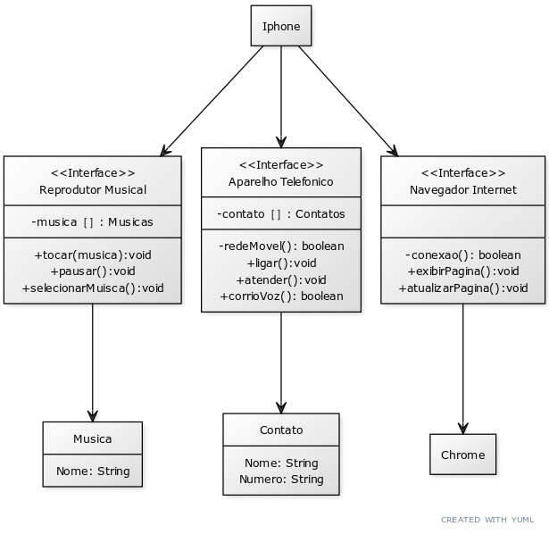

iPhone
A classe iPhone é a classe principal que representa o dispositivo como um todo. Ela implementa as interfaces ReprodutorMusical, AparelhoTelefonico e NavegadorInternet. Isso permite que o iPhone desempenhe os papéis de reprodutor musical, aparelho telefônico e navegador na Internet.

ReprodutorMusical
A interface ReprodutorMusical define os métodos necessários para controlar a reprodução de música, como tocar(), pausar() e selecionarMusica(). As classes que implementam essa interface são capazes de reproduzir músicas.

AparelhoTelefonico
A interface AparelhoTelefonico define os métodos para realizar chamadas telefônicas e enviar mensagens, incluindo ligar(), atender() e iniciarCorreioVoz(). As classes que implementam essa interface podem funcionar como dispositivos telefônicos.

NavegadorInternet
A interface NavegadorInternet define métodos para a navegação na web, como exibirPagina(), adicionarNovaAba() e atualizarPagina(). As classes que implementam essa interface podem atuar como navegadores da Internet.

Cada classe ou interface desempenha um papel específico no sistema e contribui para a versatilidade do dispositivo iPhone, tornando-o capaz de realizar uma variedade de funções.

Se você deseja explorar mais detalhes do diagrama de classes clique aqui para ser redirecionado ao arquivo PDF correspondente.

## UML Codigo de criação YUML

[≪Interface≫;Reprodutor Musical|-musica［］: Musicas|+tocar(musica):void; +pausar():void; +selecionarMuisca():void]

[≪Interface≫;Aparelho Telefonico|-contato［］: Contatos|-redeMovel(): boolean; +ligar():void; +atender():void; +corrioVoz(): boolean]

[≪Interface≫;Navegador Internet| |-conexao(): boolean; +exibirPagina():void; +atualizarPagina():void]

[Iphone] -> [Reprodutor Musical]
[Iphone] -> [Aparelho Telefonico]
[Iphone] -> [Navegador Internet]

[Reprodutor Musical] -> [Musica| Nome: String]
[Aparelho Telefonico] -> [Contato| Nome: String; Numero: String]
[Navegador Internet] -> [Chrome]

